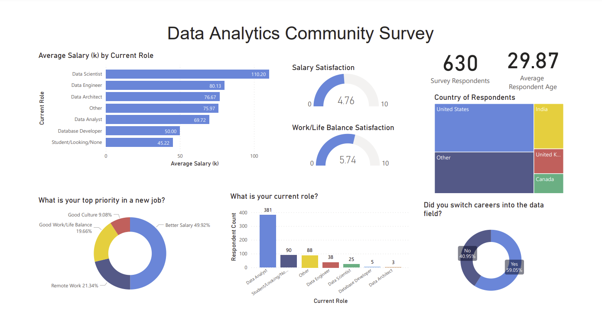
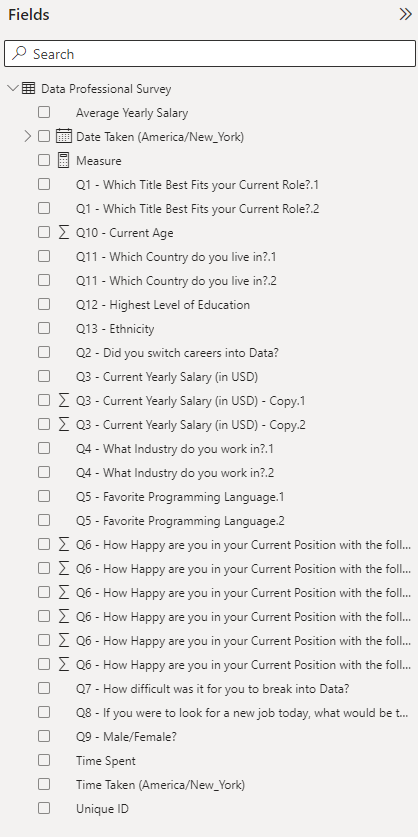
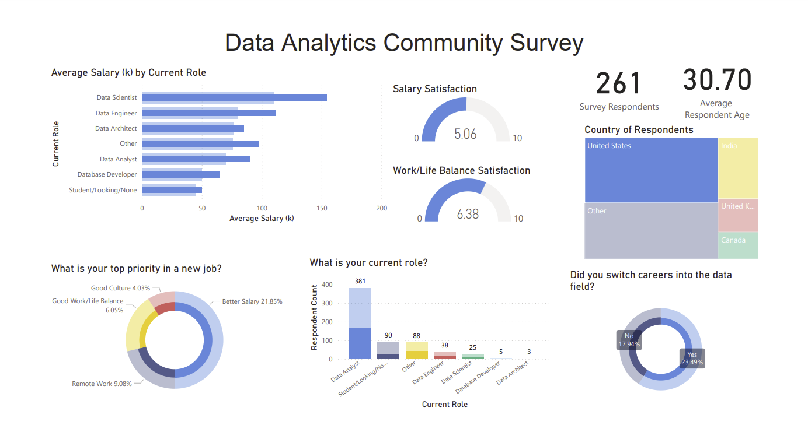
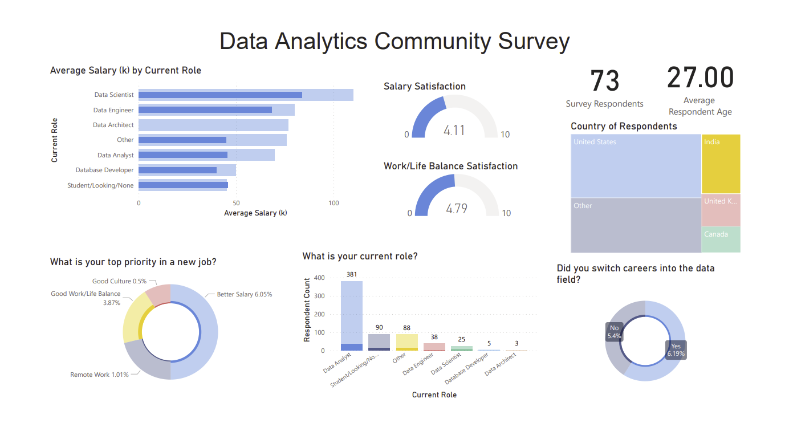
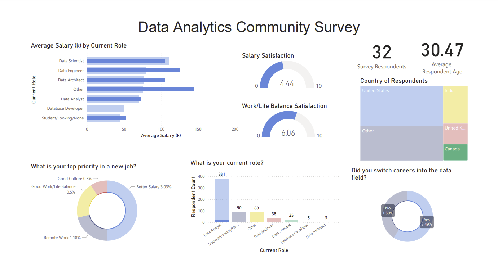
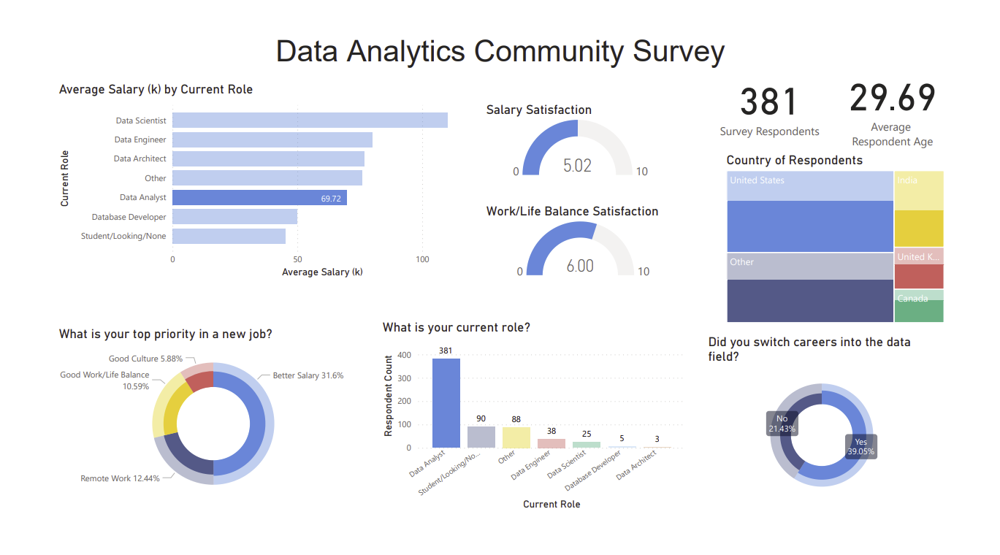
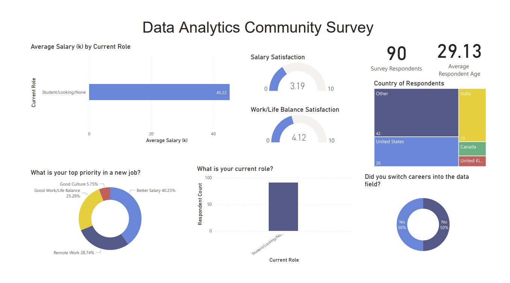

# Power BI Survey

## Overview of the Analysis:

Context:
* This data was collected by Alex Freberg via a survey of 630 respondents from the audience of his data analytics educational content. 

Purpose:
* Create a dashboard for 'first look', high level visualizations of the respondent data, including demographic information, job titles, salary, and qualitative satistifaction responses.

Tasks:
* Clean the data in PowerBI, including simplifying and binning all 'other'responses as well as transforming categorical salary responses to numerical data types for further aggregation.
* Build high level summary visualizations in PowerBI.

## Results:

### Dashboard 

### Fields

### Country Filters

#### United States 

#### India

#### Canada

### Job Title Filters

#### Data Analyst

#### Student/Looking/None

## Summary:

### General
* **41%** (261/630) of respondents are from the U.S. 
* **60%** (381/630) of respondents’ current role is Data Analyst. 
* **60%** of respondents have switched careers into the  data field. 
* Average salary by role range is **45k** (student/looking) - **110k** (data scientist).

### Country Comparison 
* **Salary:** U.S. is higher than average for every role, Canada is higher than average for most roles, India is lower than average for every role. 
* **Age:** North American respondents average age 30, slightly higher than total average of 29. Indian respondents average age 27.

### Data Analyst and Student/Job Seeker Comparison 
* **Salary:** Data Analysts' average salary is 24k higher than Students'.  
* **Satisfaction:** Students rated salary and work/life balance satisfaction 1.8 points lower than Data Analysts. 
* **Age:** Data Analysts are slightly older on average than Students (0.5 years).
* **Career Switch:** Students at 50/50, Data Analysts at 65/35. 
* **New Job Priorities:** Students placed a higher priority on work/life balance and remote work (both categories 8% higher than Data Analysts) and Data Analysts placed higher priority on a better salary (12% higher than students).

### Recommendations
* Finer detail data transforming in Python to more meaningfully group respondents' custom answers for the 'Other' option on multiple choice questions, especially ethnicity/race, country, job title, favorite programming language. A lot of granularity was lost by simplifying all 'Other' responses into one bin in PowerBI. The Jupyter Notebook file in this repository contains the beginnings of this data cleaning.

* Create more advanced filters/drill down elements to compare across demographic information, using the more granular binning outlined above.

* Data sampling limitations: job titles and countries are not equally represented in our survey respondents, which can limit the usefulness of comparisons (i.e. 380 data analysts and 3 data architects, 260 U.S. respondents and 73 Indian respondents).

