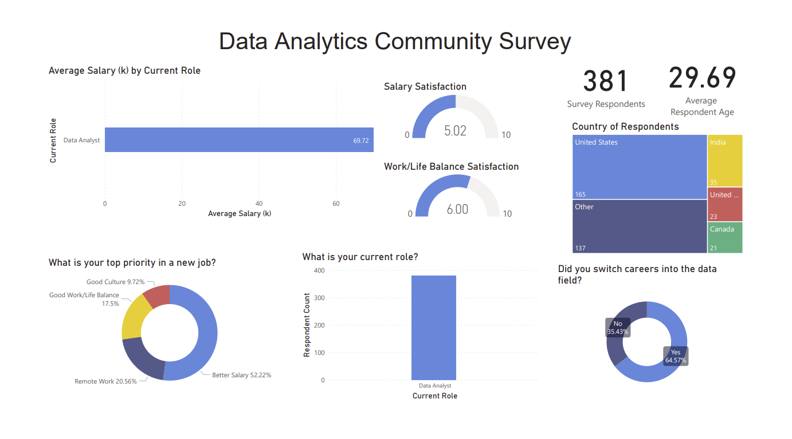

# Power BI Survey

## Overview of the Analysis:

Context:
* This data was collected by Alex Freberg via a survey of 630 respondents from the audience of his data analytics educational content. 

Purpose:
* Create a dashboard for 'first look', high level visualizations of the respondent data, including demographic information, job titles, salary, and qualitative satistifaction responses.

Tasks:
* Clean the data in PowerBI, including simplifying and binning all 'other'responses as well as transforming categorical salary responses to numerical data types for further aggregation.
* Build high level summary visualizations in PowerBI.

## Results:

### Dashboard 

### Fields

### Country Filters

#### United States 

#### India

#### Canada

### Job Title Filters

#### Data Analyst

#### Student/Looking/None

## Summary:

### General (x3)
  * x
  * x
  *  

### Country Comparison 
  * salary
  * age N Am 30, India 27

### Data Analyst and Student/Job Seeker Comparison 
* salary (more obvious), satisfaction for salary and worklife balance, 
* similar age, 
* switch careers 50/50 for students, 65/35 for analysts
* students higher priority on work/life balance and remote work (both categories 8% higher vs analysts) and analysts higher priority on higher salary (12% higher vs students)

### Recommendations:
* Finer detail data processing in Python to more meaningfully clean and group respondents' custom answers for the 'Other' option on multiple choice questions, especially ethnicity/race, country, job title, favorite programming language. A lot of granularity was lost by simplifying all 'Other' responses into one bin in PowerBI. The Jupyter Notebook file in this repository contains the beginnings of this data cleaning.  
* Create more advanced filters/drill down elements to compare across demographic information, using the more graular binning outlined above.  
* Data sampling limitations: job titles and countries are not equally represented in our survey respondents, which can limit the usefulness of comparisons (i.e. 380 data analysts and  3 data architects, 260 U.S. respondents and 73 India respondents).

